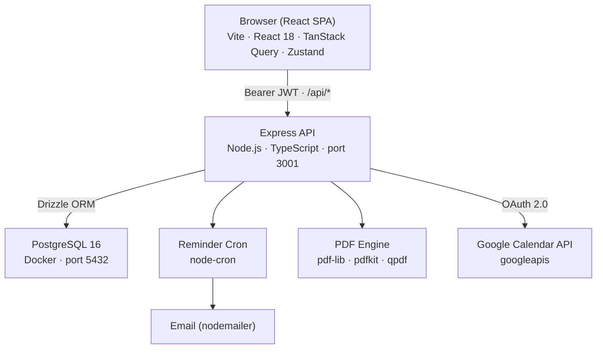

<!-- generated-by: gsd-doc-writer -->
# Architecture

## System overview

Assistansportal is a care management platform built for families and small operators managing Swedish personal assistance (LSS). It follows a classic client–server architecture: a React single-page application communicates with a Node.js/Express REST API, which persists data in a PostgreSQL database. The system's core responsibility is to automate the administrative cycle required by Swedish law — logging assistant hours, generating Försäkringskassan forms (FK 3057, FK 3059), calculating payroll, and issuing lönespecifikationer (Skatteverket blankett 4805) — while enforcing the compliance rules codified in `docs/compliance/swedish-fk-and-labor-rules.md`.

---

## Component diagram



---

## Data flow

A typical guardian monthly compliance cycle moves through the system as follows:

1. **Login** — The browser POSTs credentials to `/api/auth/login`. The server validates the password hash (bcryptjs), issues a signed JWT, and returns it. The client persists the token in `localStorage` via the Zustand `useAuthStore`.
2. **Hour entry** — The guardian proposes shifts on the Home page. The client POSTs to `/api/entries`; the server validates via `requireGuardian` middleware, persists a row in the `entries` table with `reqStatus: "pending"`, and optionally syncs the event to Google Calendar via `/api/gcal`.
3. **Clock-in / clock-out** — Assistants hit `/api/clock` from their dashboard. On clock-out the server auto-creates an `entries` row with `verified: true` and a matching `clock_events` row recording IP and user-agent as audit evidence.
4. **Payroll generation** — The guardian navigates to Monthly. The client POSTs to `/api/payroll/generate`; the server calls `calculatePayroll()` from `lib/payroll-utils.ts` (pure function, no DB calls), snapshots the hourly rate and tax rate into `payroll_records`, and sets `status: "draft"`.
5. **PDF generation** — Once payroll is approved, the client requests `/api/pdf/fk3057`, `/api/pdf/fk3059`, or `/api/pdf/lonespec`. The server fills the pre-loaded PDF templates in `forms/` using `pdf-lib`, applies password encryption via `qpdf` where required, and streams the result back.
6. **Compliance reminder** — The `startReminderCron()` job (node-cron, daily) reads the configured reminder day from the `settings` table. When the day matches, it checks pending compliance flags and sends an email via nodemailer.

---

## Key abstractions

| Name | Type | Location | Purpose |
|---|---|---|---|
| `schema` | Drizzle table definitions | `server/src/db/schema.ts` | Single source of truth for all database tables and enums |
| `requireAuth` / `requireGuardian` / `requireAssistant` | Express middleware | `server/src/middleware/auth.ts` | JWT verification and role enforcement on every protected route |
| `calculatePayroll` | Pure function | `server/src/lib/payroll-utils.ts` | Computes gross pay and employer contributions from billable hours, hourly rate, and costs |
| `buildForm4805Fields` | Pure function | `server/src/lib/form4805-utils.ts` | Maps profile and assistant data to the Skatteverket blankett 4805 PDF field names |
| `resolveEmployerRepresentation` | Pure function | `server/src/lib/employer-representation.ts` | Determines the correct employer/signatory identity based on `patientRequiresRepresentative` |
| `buildAnhorigSlip` / `renderAnhorigSlipPdf` | Pure functions | `server/src/lib/payrollSlipUtils.ts`, `pdfSlipRenderer.ts` | Assembles and renders the lönespecifikation PDF |
| `shouldSendReminder` / `buildPendingSteps` | Pure functions | `server/src/lib/reminderCron.ts` | Testable logic for compliance reminder scheduling |
| `filterBillableEntries` | Pure function | `server/src/lib/absence-utils.ts` | Subtracts absence hours from entries to compute FK-billable hours |
| `useAuthStore` | Zustand store | `client/src/store/auth.ts` | Client-side auth state (JWT token, role, dual-role view switching) |
| `api` | Axios instance | `client/src/lib/api.ts` | Shared HTTP client; attaches Bearer token and handles 401 redirect |

---

## Directory structure rationale

```
assistansportal/
├── client/                  React SPA (Vite)
│   ├── src/
│   │   ├── pages/           Full-page route components (Home, Monthly, Records, Settings, AssistantDashboard, …)
│   │   ├── components/      Shared layout and shadcn/ui-based UI primitives (Layout, ui/)
│   │   ├── store/           Zustand stores (auth state)
│   │   └── lib/             Axios instance, TypeScript types, client-side utilities
│   └── e2e/                 Playwright end-to-end tests
│
├── server/                  Express REST API (Node.js)
│   ├── src/
│   │   ├── routes/          One file per API resource (auth, entries, assistants, pdf, payroll, …)
│   │   │   └── __tests__/   Vitest + Supertest integration tests for routes
│   │   ├── middleware/       JWT auth and role-gate middleware
│   │   ├── db/              Drizzle ORM schema, connection, and seed logic
│   │   └── lib/             Pure domain logic: payroll, PDF field builders, cron, email, utilities
│   └── drizzle/             Drizzle-kit generated SQL migration files
│
├── forms/                   Static FK and Skatteverket PDF templates
│   ├── fk3057.pdf           FK 3057 — monthly hour report template
│   ├── fk3059.pdf           FK 3059 — reimbursement application template
│   └── skv4805.pdf          Skatteverket blankett 4805 — AGI employer report template
│
├── docs/                    Project documentation
└── docker-compose.yml       Local PostgreSQL 16 service
```

**Design rationale:**

- `client/` and `server/` are separate npm workspaces with independent `package.json` files, allowing the frontend and backend to be built, tested, and deployed independently.
- All domain logic in `server/src/lib/` is written as pure functions with no database imports. This makes the compliance-critical payroll and PDF calculations independently testable without a running database.
- PDF templates are stored as static files in `forms/` at the project root so both the server and any future tooling can reference them by a stable relative path.
- Route files in `server/src/routes/` are kept thin — they validate inputs with Zod, delegate computation to `lib/` functions, and write results to the database. Business logic does not live in route handlers.
